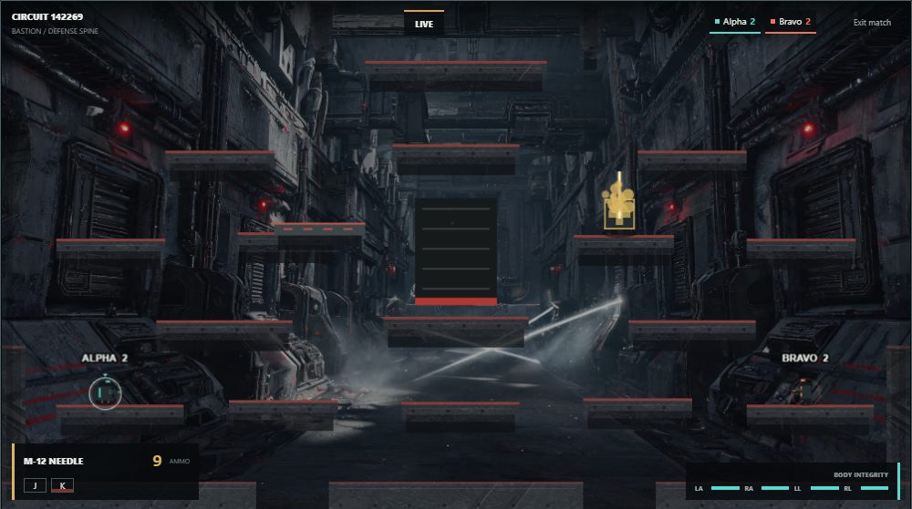
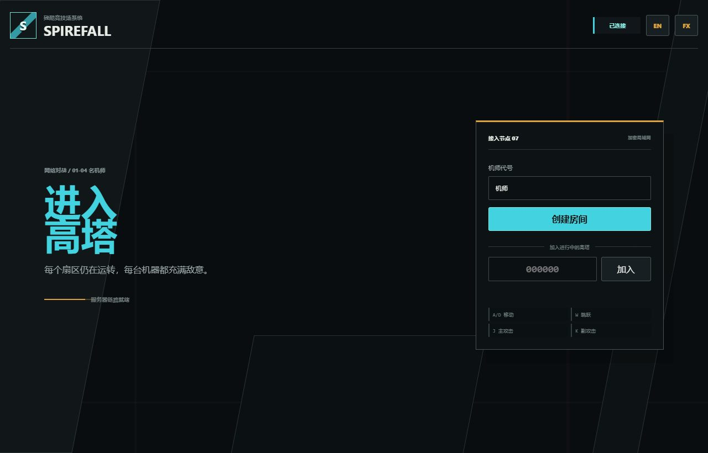
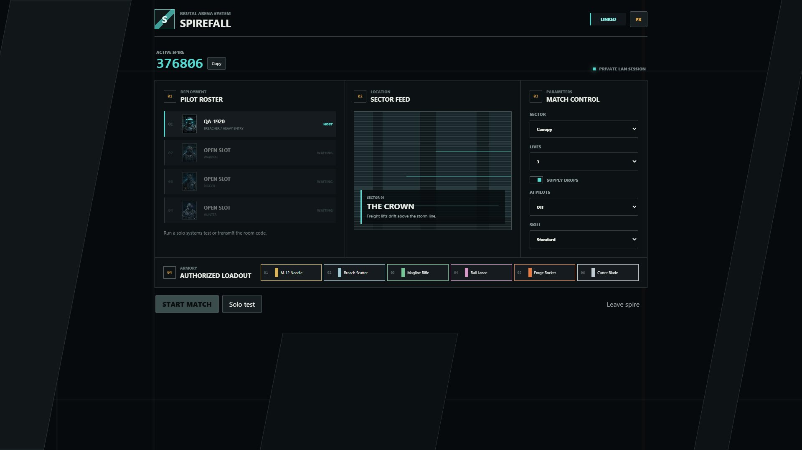
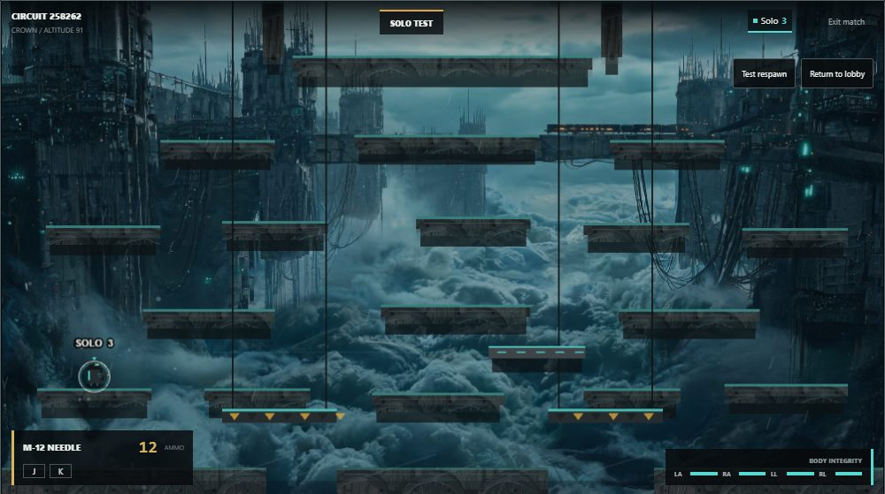
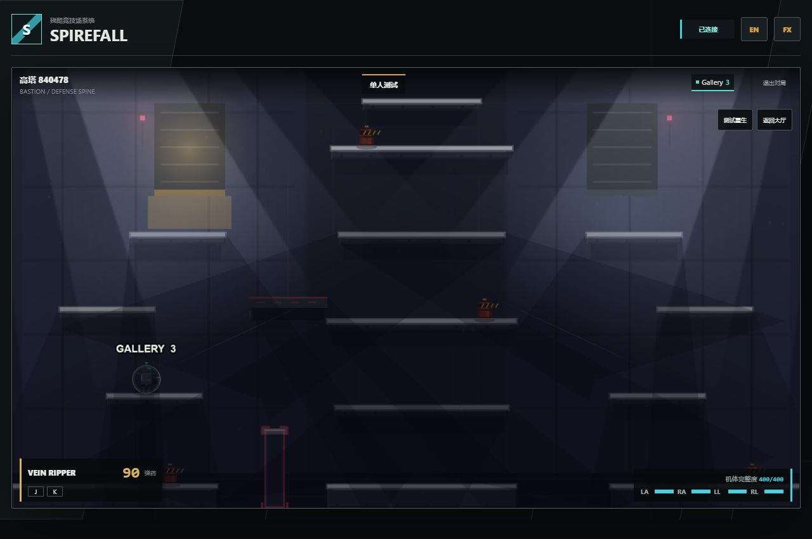
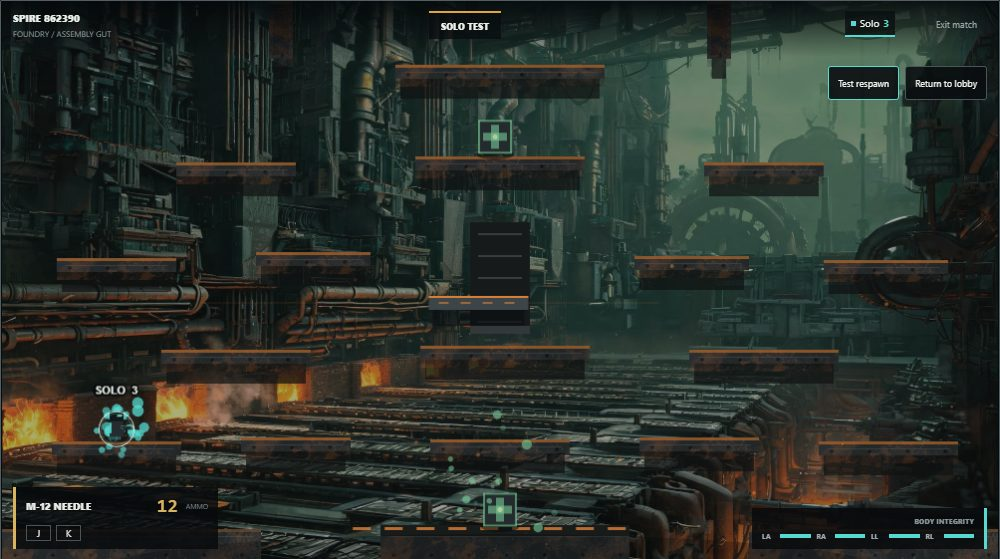
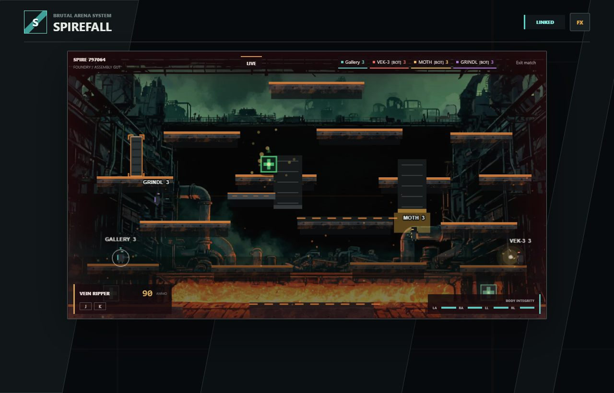

# Spirefall

<p align="center">
  
</p>

**Spirefall** is a clean-room browser arena shooter set inside a decaying brutalist megastructure. Four pilots battle across three sectors of one vertical spire — storm-lashed canopy, defense spine, and foundry floor — with server-authoritative physics, weapons, hazards, and dismemberment. Knock every rival off the structure; the last pilot standing holds the spire. The original SWF is used only as a read-only behavioral reference; no original art, audio, branding, or code is shipped by this project.

## Screenshots

| | |
|---|---|
|  |  |
| **Main menu** | **Tournament lobby — roster, sector feed, match control, armory** |
|  |  |
| **Canopy — altitude 91, freight lifts above the storm line** | **Fortress — defense spine with blast crusher** |
|  |  |
| **Factory — foundry floor, conveyors and forge pistons** | **Four-player load test on the foundry floor** |

## Run locally

Requirements: Node.js 20 or newer.

**Windows one-click launcher** — double-click `Spirefall.bat`. On first run it installs dependencies, then it starts the game server and web client together and opens your browser at the game automatically. Keep the window open while playing; closing it stops both servers.

Manual setup:

```powershell
npm install
npm run dev
```

Open `http://localhost:5173`. The WebSocket game server listens on port `8787`.

For LAN play, other players open `http://<host-ip>:5173` and enter the six-digit room code. Windows Firewall may ask for permission for Node.js on private networks; allow private-network access for LAN play.

For one-player setup and feel checks, create a room and choose **Solo test**. The sandbox uses the selected map, lives, crates, and weapon set, respawns after falls without declaring a winner, offers a `Test respawn` control, and can return directly to the lobby. Normal multiplayer matches still require at least two pilots.

**Leaving a room** — `Leave spire` (lobby), `Exit match` (in-game HUD), and `Leave spire` (results screen) all exit immediately: the slot is released server-side with no reconnect hold, the local session is cleared, and the browser returns to the main menu.

## Game systems

- **Three sectors of one megastructure.** Canopy, Fortress, and Factory share a vertical industrial theme with ~20 platforms each: small ledges, staggered towers, solid walls, lethal floor gaps, one moving platform, and map-specific machinery.
- **Authoritative hazards.** Cargo lifts, blast crushers, conveyors, and forge pistons run entirely on server ticks — warning and lethal windows are fair and identical for every client.
- **Limb integrity instead of health bars.** Arm damage raises cooldown and recoil; leg damage cuts movement and jump output; hits are resolved per body region; dismemberment is a cosmetic client event; respawning restores everything.
- **Six weapons, twelve attacks.** Every weapon defines separate primary (`J`) and secondary (`K`) attacks with independent cooldown, ammo, recoil, damage, and knockback — bursts, pellets, piercing shots, clusters, slashes, and dash slashes are all server-simulated.
- **Randomized supply crates.** Platform-aligned sockets spawn weapon crates on randomized timers with highlight pulses and warning beams.
- **Event-driven effects.** Tracers, explosions, sparks, smoke, blood decals, and detached parts are driven by server combat events. `Gore` and `Camera shake` are local visual preferences under the `FX` control.
- **Immersive rendering.** Generated bitmap environments with parallax far-layers, baked platform textures with material overlays, and per-map atmosphere particles (canopy rain, fortress dust, factory embers). The procedural renderer remains as a guaranteed fallback when assets are missing.

## Controls

- `A` / `D`: move
- `W`: jump (triple jump)
- `S`: drop through one-way platforms
- `J`: primary attack
- `K`: secondary attack
- `1`-`6`: select a weapon
- Mouse wheel: cycle weapons
- `Tab` (hold): weapon panel — keycap, live ammo, and attack patterns for every weapon in the match

## AI pilots

The room host can fill empty slots with server-authoritative bot pilots from the lobby (`AI pilots` count plus `Skill` tier: Casual / Standard / Brutal). Bots occupy real player slots, fight under the same limb, cooldown, crate, and hazard rules as humans, navigate a BFS platform graph, perceive only public match state through a tier-dependent reaction delay, and never disconnect. Brutal-tier pilots dodge hazard warnings. They work in both solo sandbox sessions (1 human + up to 3 bots) and normal matches (any human/bot mix totaling at least 2 pilots). If the host leaves, ownership migrates immediately to another human; bots never inherit the room.

## Verification

With the development server running:

```powershell
npm run build
npm run test:logic
npm run test:smoke
npm run test:browser
npm run test:visual
npm run test:performance
```

`test:logic` checks deterministic limb penalties, hit regions, lift and mover travel, hazard phases, navigation-graph connectivity, and map authoring rules. `test:smoke` verifies room creation, joining, settings, authoritative match start, weapon-slot switching, ranged hits, disconnect slot retention, reconnect, the solo sandbox lifecycle, bot roster materialization, bot activity, host migration away from bots, sandbox-with-bots, elimination freeze (no post-death simulation, no repeated death events, prompt match resolution), and immediate `leave_room` slot release. `test:browser` covers multiplayer and solo UI flows, three maps, J/K, the Tab weapon panel, visual preferences, screenshots, and refresh recovery. `test:visual` checks the menu, lobby, canvas, HUD, overflow, and nonblank rendering at four desktop viewports. `test:performance` drives four isolated clients through simultaneous J/K attacks and records frame timing plus a load screenshot.

## Architecture

- `src/`: Phaser client, menus, HUD, rendering, input prediction, and interpolation.
- `server/`: authoritative Node.js WebSocket room and match server, including the bot pilot runtime.
- `shared/`: maps, weapons, physics constants, and shared protocol types — the single contract layer.
- `tests/`: repeatable network and browser smoke tests.
- `docs/`: behavioral reference notes, art direction with generation prompts, development progress, and screenshots.

The first release intentionally excludes accounts, matchmaking, teams, mobile controls, spectators, and public hosting. (AI bot pilots were added in the August 2026 round as host-controlled slot fillers; see "AI pilots" above.)
